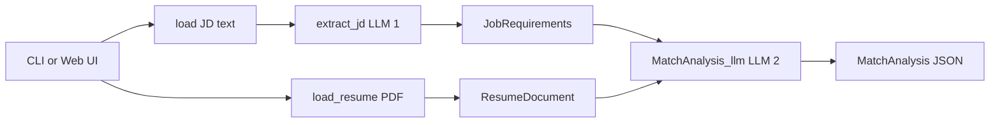
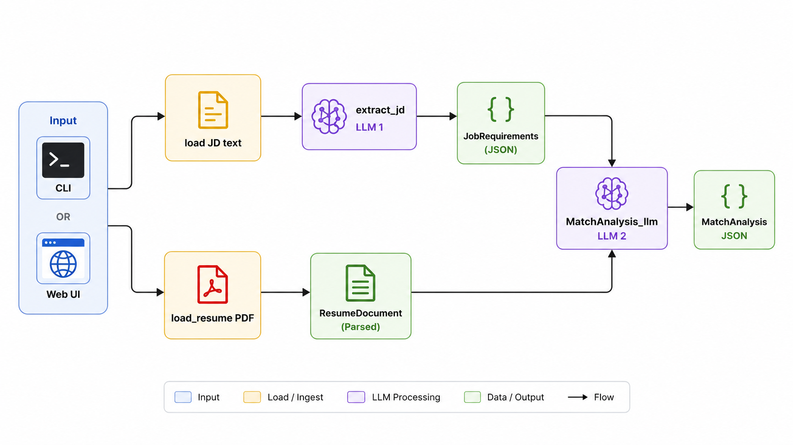
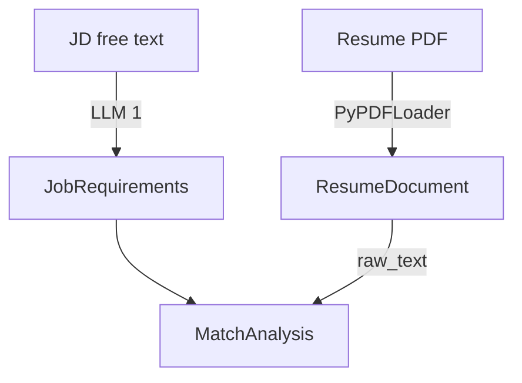
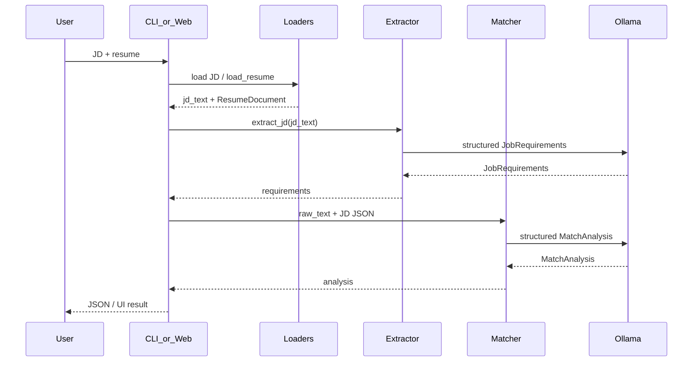

# RoleFit AI Agent

A local LangChain pipeline that compares a **job description** to a **resume PDF** and returns a structured match analysis: score, matched vs missing skills, strengths, gaps, verdict, and evidence quotes.

It runs on **Ollama** (no cloud API required for the core loop). Use it from the **CLI** or an optional **Streamlit** web UI — both call the same core functions.

## Requirements

- Python 3.11+
- [Ollama](https://ollama.com/) installed and running
- A local chat model pulled in Ollama (default: `llama3.1:8b`)

```bash
ollama serve
ollama pull llama3.1:8b
```

---

## Setup

From the `resume-jd-match/` directory:

```bash
python3 -m venv .venv
source .venv/bin/activate          # Windows: .venv\Scripts\activate
pip install -e .

cp .env.example .env               # then edit LLM_MODEL if needed
```

Optional web UI dependency:

```bash
pip install -e '.[web]'
```

---


## Configuration

`.env` (see `.env.example`):

```env
LLM_MODEL=llama3.1:8b
```

The model name must match something available from `ollama list`.

---


# RoleFit AI Agent — Architecture

Local CLI (and optional Streamlit web UI) pipeline that matches a resume PDF against a job description using **two LangChain LLM specialists** on **Ollama**, with **Pydantic structured outputs**.

This document describes the system as built. It is a pipeline with specialists, not a free-form chatbot.

---


## 1. Purpose


| Input                                        | Output                                  |
| -------------------------------------------- | --------------------------------------- |
| Job description (`.txt` file or pasted text) | Structured match report                 |
| Resume (`.pdf`)                              | Score, skills, verdict, evidence quotes |


**In scope (v1):** local Ollama, two LLM calls, PDF loading, CLI, optional Streamlit UI.  
**Out of scope (v1):** cloud APIs, embeddings/RAG, ReAct tool-calling agents, resume LLM extraction.

**Design principle:** working functions first; orchestration (LangGraph) can wrap them later without rewriting core logic.

---


## 2. High-level pipeline




Two LLM calls by design:

1. **Normalize** messy JD text → `JobRequirements`
2. **Compare** that JSON + resume `raw_text` → `MatchAnalysis`

The resume is **not** passed through a third LLM extractor in v1. It is loaded as text and judged by the matcher.

### High-level workflow



Both the CLI and Web UI feed the same pipeline: load the job description and resume, extract structured requirements with LLM 1, compare those requirements with parsed resume text using LLM 2, and return a structured `MatchAnalysis` JSON result.

---


## 3. Repository layout

```text
resume-jd-match/
├── pyproject.toml              # package metadata, deps, entry points
├── .env / .env.example         # LLM_MODEL
├── ARCHITECTURE.md             # this file
├── INTERVIEW_GUIDE.md          # interview talking points
├── WEB_UI.md                   # how to run the Streamlit UI
├── AboutProjectV1.txt          # original product brief
├── web_app.py                  # Streamlit UI (additive wrapper)
├── samples/
│   ├── sample_jd.txt
│   └── AnkurSehrawat_Resume.pdf
└── src/resume_agent/
    ├── __main__.py             # python -m resume_agent → cli.main
    ├── cli.py                  # argparse orchestration
    ├── config.py               # env → LLM_MODEL
    ├── llm_connection.py       # ChatOllama factory (get_llm)
    ├── schemas.py              # Pydantic contracts
    ├── loaders.py              # JD text + resume PDF I/O
    ├── jd_extractor.py         # Specialist 1
    └── matcher.py              # Specialist 2
```

---


## 4. Component responsibilities


| Module              | Responsibility                                  | Uses LLM?     |
| ------------------- | ----------------------------------------------- | ------------- |
| `config.py`         | Load `.env`, expose `LLM_MODEL`                 | No            |
| `llm_connection.py` | Shared `ChatOllama` via `get_llm()`             | Setup only    |
| `loaders.py`        | Validate paths; read JD; PDF → `ResumeDocument` | No            |
| `schemas.py`        | Data contracts shared by CLI, UI, and chains    | No            |
| `jd_extractor.py`   | Messy JD → `JobRequirements`                    | Yes (call 1)  |
| `matcher.py`        | JD JSON + resume text → `MatchAnalysis`         | Yes (call 2)  |
| `cli.py`            | File-based orchestration for terminal use       | Orchestration |
| `web_app.py`        | Streamlit UI; calls same core functions         | Orchestration |


Core business logic lives under `src/resume_agent/`. The web UI is an **additive wrapper**; it does not replace the CLI.

---


## 5. Data contracts (`schemas.py`)




### `JobRequirements` (LLM output from JD)

- `role: str`
- `seniority: str`
- `must_have_skills: list[str]`
- `nice_to_have_skills: list[str]`
- `notes: str`


### `ResumeDocument` (loader output, not LLM)

- `raw_text: str` — full extracted text for the matcher
- `source_path: str`
- `page_count: int | None`


### `MatchAnalysis` (LLM output from match)

- `match_score: int` (0–100)
- `matched_skills: list[str]`
- `missing_skills: list[str]`
- `strengths: list[str]`
- `gaps: list[str]`
- `verdict: Verdict` — `strong` | `borderline` | `weak`
- `evidence: list[str]` — short quotes from the resume


### `Verdict`

Enum used to constrain the final label and reduce free-form drift.

**Why schemas matter:** they are the contract between steps. Messy company JDs stay free-form on input; the app always consumes a stable JSON shape after extraction.

---


## 6. Runtime data flow

```text
1. Entry: CLI flags or Web UI form

2. Load JD
   - CLI: load_jd_text(path) → str
   - Web: pasted text from text area
   - Fail fast on missing/empty file (CLI)

3. Load resume
   - load_resume(path) → ResumeDocument
   - PyPDFLoader → join Document.page_content across pages
   - Web saves upload to a temp .pdf, then calls the same loader
   - Fail fast on missing/unsupported/empty PDF

4. Extract JD (LLM 1)
   - extract_jd(jd_text) → JobRequirements
   - ChatPromptTemplate | ChatOllama.with_structured_output(JobRequirements)

5. Match (LLM 2)
   - MatchAnalysis_llm(resume.raw_text, jd.model_dump_json()) → MatchAnalysis
   - ChatPromptTemplate | ChatOllama.with_structured_output(MatchAnalysis)

6. Present result
   - CLI: print JSON (under --debug today)
   - Web: metrics UI + downloadable JSON
```

---


## 7. LangChain patterns used


| Pattern                         | Where                           | Role                                   |
| ------------------------------- | ------------------------------- | -------------------------------------- |
| `ChatOllama`                    | `llm_connection.py`             | Local chat model                       |
| `ChatPromptTemplate`            | `jd_extractor.py`, `matcher.py` | System + human prompts                 |
| LCEL `prompt | model`           | both specialists                | Runnable chain                         |
| `with_structured_output(Model)` | both specialists                | Force Pydantic-shaped replies          |
| `PyPDFLoader`                   | `loaders.py`                    | PDF → LangChain `Document` list → text |


### What `with_structured_output` does

Normal `llm.invoke(...)` returns free-form text.  
`llm.with_structured_output(SomeModel)` constrains the reply to a Pydantic schema so callers receive a typed object (`JobRequirements` or `MatchAnalysis`), not a paragraph.

Shape is guaranteed (or validation fails). Content accuracy still depends on prompts, model quality, and optional Python post-checks.

---


## 8. Specialist design


### JD extractor (`jd_extractor.py`)

- **Job:** form-filler for inconsistent JD layouts
- **Input:** free-form JD text
- **Output:** `JobRequirements`
- **Rules:** extract only what is stated; map mandatory skills to `must_have_skills`; use `"unspecified"` when seniority is unclear


### Matcher (`matcher.py`)

- **Job:** hiring match analyst
- **Input:** JD JSON string + resume `raw_text`
- **Output:** `MatchAnalysis`
- **Rules:** must-haves weigh more than nice-to-haves; evidence should be short resume quotes; tolerate messy PDF reading order


### Why not a resume LLM extractor in v1

Resumes in this project are short enough to pass as text. A third structured call would add latency, cost, and another hallucination surface. Accuracy upgrades that fit v1 better: Python skill-list enforcement, evidence substring checks, and score/verdict derived from must-have coverage.

---


## 9. Error handling

```text
Bad path / empty JD / unreadable or empty PDF
  → InputError in loaders
  → CLI: stderr + exit 1 (no LLM call)
  → Web: st.error(...)

LLM / schema failures
  → surface from extract_jd / MatchAnalysis_llm
  → Web catches and shows error; CLI currently lets them bubble
```

File validation stays in Python. The model is never asked to “handle” missing files.

---


## 10. Configuration

```text
.env
  LLM_MODEL=llama3.1:8b   # example

config.py
  load_dotenv()
  LLM_MODEL = os.getenv("LLM_MODEL", "llama3.1:8b")

llm_connection.get_llm()
  → ChatOllama(model=LLM_MODEL, ...)
```

Requires a running Ollama server and a pulled model matching `LLM_MODEL`.

---


## 11. Interfaces: CLI vs Web


### CLI

```bash
python -m resume_agent \
  --jd samples/sample_jd.txt \
  --resume samples/AnkurSehrawat_Resume.pdf \
  --debug
```

- `--jd` path to JD text file  
- `--resume` path to resume PDF  
- `--out` reserved for saving JSON (not fully wired yet)  
- `--debug` currently gates extract + match + JSON print


### Web UI (`web_app.py`)

```bash
pip install -e '.[web]'
streamlit run web_app.py
```

- Paste JD text; upload PDF  
- Calls the same `load_resume` → `extract_jd` → `MatchAnalysis_llm`  
- Shows score/verdict/skills and allows JSON download

The web UI does **not** require changes to the CLI path; both are frontends over shared core functions.

---


## 12. Sequence (happy path)




---


## 13. Known limitations and next upgrades


| Area          | Current state                                   | Sensible next step                                 |
| ------------- | ----------------------------------------------- | -------------------------------------------------- |
| PDF layout    | Multi-column resumes can scramble reading order | Light cleanup; optional PyMuPDF later              |
| Skill lists   | Local models may leave lists empty              | Python post-fill from must-haves + resume text     |
| Evidence      | Model may invent quotes                         | Substring verify against `raw_text`                |
| Scoring       | LLM score can drift between runs                | Hybrid: coverage-based base score + LLM commentary |
| Orchestration | Linear function calls                           | LangGraph: parallel load/extract → match           |
| CLI UX        | Analysis mainly under `--debug`                 | Always-on match + implement `--out`                |
| Packaging     | Optional `[web]` extra for Streamlit            | Keep core deps free of UI                          |


---


## 14. Design decisions (summary)

1. **Pipeline over chatbot** — fixed steps, easier to debug and test.
2. **Structure the JD, keep the resume as text** — one skill vocabulary for matching.
3. **Functions before graph** — each specialist is independently runnable.
4. **Local Ollama** — no cloud dependency for learning and demos.
5. **Pydantic as the contract** — CLI, Web, and future graph share the same types.
6. **UI as a wrapper** — Streamlit does not fork business logic.

---


## 15. Mental model

```text
Messy world          App contracts           Decision
─────────────        ─────────────           ────────
JD (any layout)  →   JobRequirements    ─┐
Resume PDF       →   ResumeDocument     ─┴→ MatchAnalysis
```

The agent’s job is not to “chat about” a resume. It is to run a small, inspectable pipeline that turns documents into a structured hiring signal.